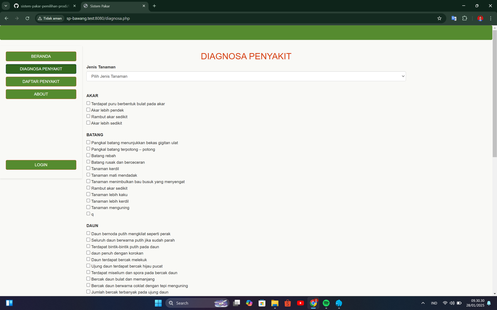
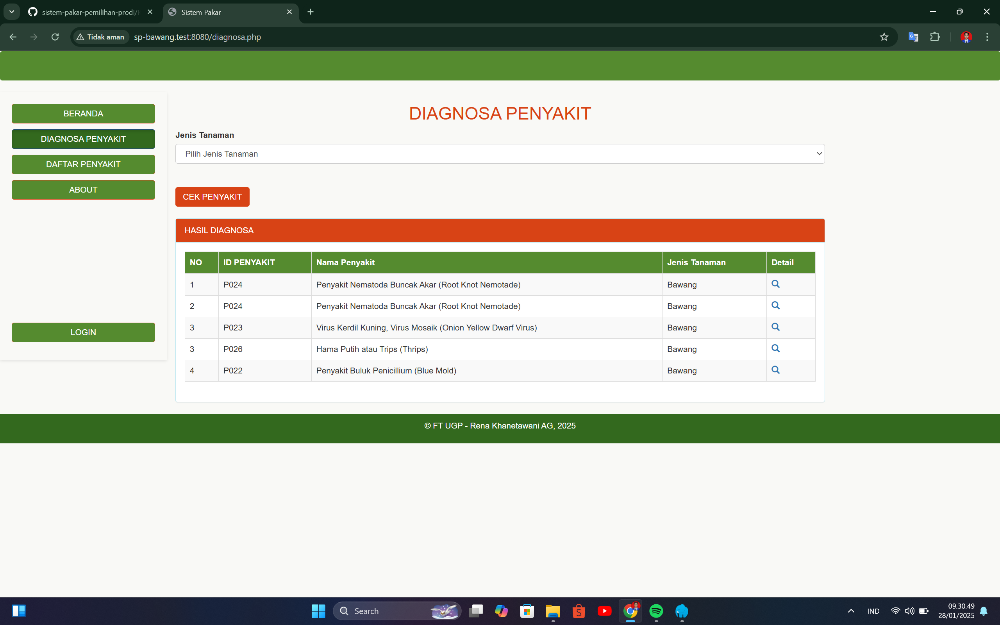
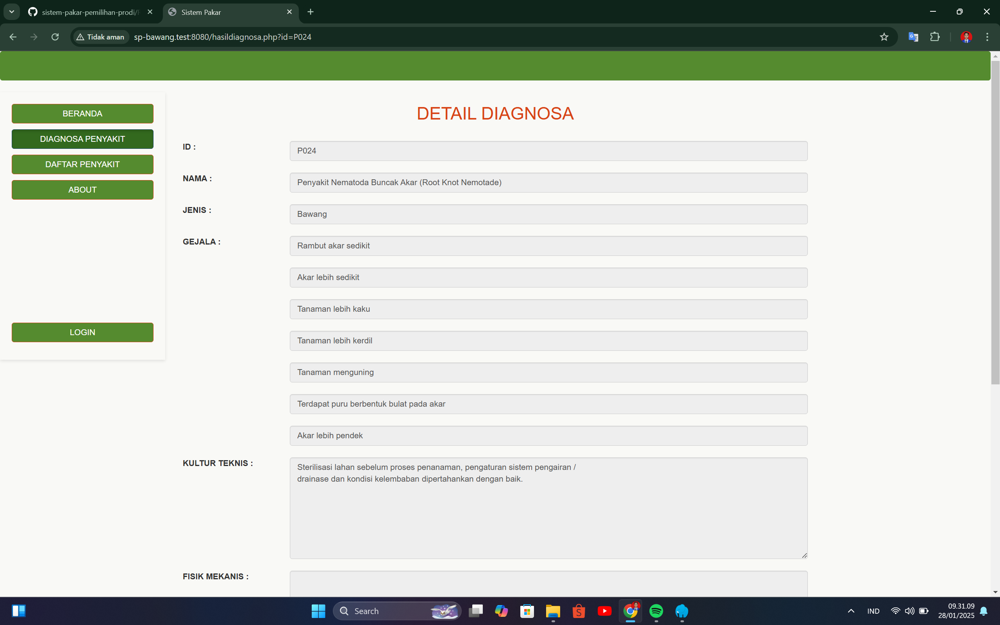
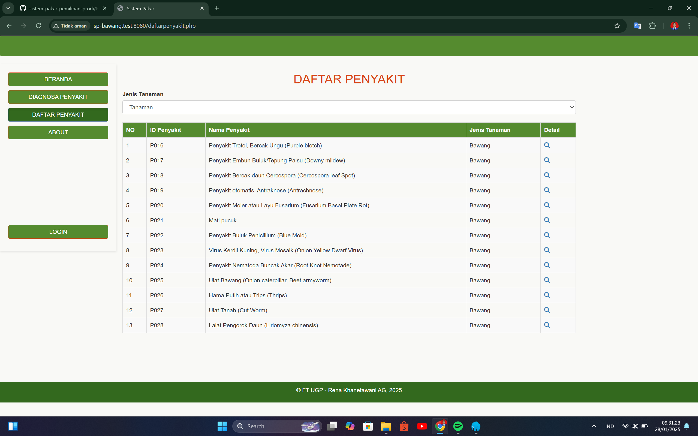
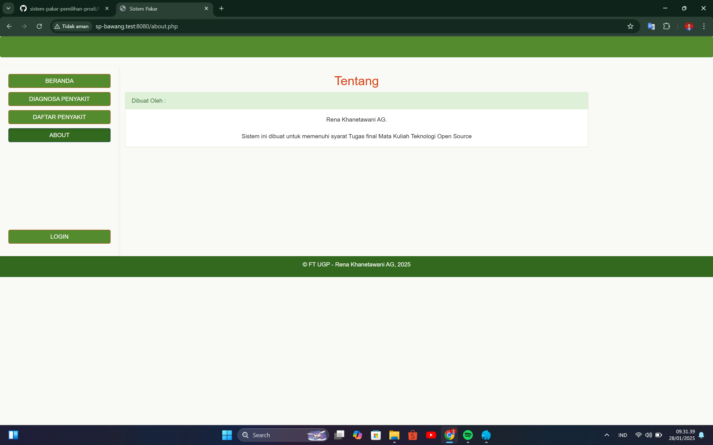

# Sistem Pakar Diagnosa Penyakit Bawang dan Cabai

Sistem Pakar Diagnosa Penyakit Bawang dan Cabai adalah aplikasi berbasis web yang dirancang untuk membantu petani dan pengguna lainnya dalam mengidentifikasi penyakit pada tanaman bawang dan cabai. Sistem ini memberikan solusi berdasarkan gejala yang ditemukan pada tanaman.

---

## Fitur Utama

- **Diagnosa Penyakit**: Mengidentifikasi penyakit bawang dan cabai berdasarkan gejala yang dimasukkan.
- **Database Gejala dan Penyakit**: Informasi lengkap mengenai penyakit dan gejala yang sering terjadi pada tanaman bawang dan cabai.
- **Rekomendasi Penanganan**: Memberikan saran tindakan atau solusi untuk menangani penyakit yang terdeteksi.
- **Antarmuka Pengguna yang Mudah**: Tampilan yang intuitif dan ramah pengguna.

---

## Teknologi yang Digunakan

- **Backend**: PHP
- **Frontend**: HTML, CSS, JavaScript
- **Database**: MySQL
- **Framework (Opsional)**: (Tambahkan jika menggunakan Laravel, CodeIgniter, atau lainnya)

---

## Instalasi dan Penggunaan

### Prasyarat
- Server web seperti **XAMPP**, **WAMP**, atau **LAMP**.
- PHP versi 7.4 atau lebih baru.
- MySQL/MariaDB untuk basis data.

## Interface Sistem 

### 1. Halaman Utama

### 2. Halaman Diagnosa Penyakit

### 3. Halaman Hasil Diagnosa Penyakit

### 4. Halaman Detail Diagnosa 

### 5. Halaman Daftar Penyakit

### 6. Halaman Tentang

